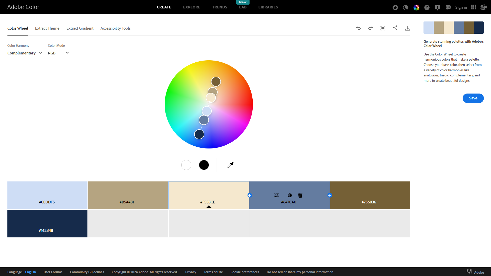

# README


## Name

Jabes Familia


## Netlify Status Badge

[](https://app.netlify.com/sites/about-me-jabes03/deploys)


## Description

In this website I added Cascading Style Sheets to my HTML. To make the website look more cleaner, I made use of the Box Model, added padding, border and spacing between each elements so it is easily distinguishable.

In this project, readability and accessibility for different kind of people was my priority.

With CSS I added unique fonts, that where also readable, added the colors that I used, managed the spaces between each element, and ordered the code so that it is easily modifiable in the future.

I made sure that the website works on different devices, from computers to phones. I build my website with the intention of my website being in mobile devices first. By using grid, flex, and floats tags I made the website adjust to different type of screen sizes.

All the embedded media on the website was taken by me, and I embedded the media into the website by using tags like ``````  and ```<iFrame>```. Each media element comes with an alternative text for people with any visual impairment.

I also added a navigation bar with the tag ```<nav>``` at the top of the page so that users can go to the section they want to see as soon as possible.


## Color Scheme


For my project I tried to use my favorite colors, `#CEDDF5` and `#B5A481`.
I also tried to be mindful of people who may suffer from correctly differentiating colors, so I made sure to the colors where not saturated


## Citations
- [w3schools](https://www.w3schools.com/)


## License

